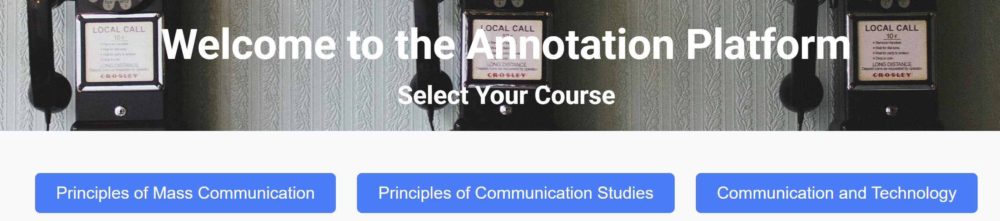
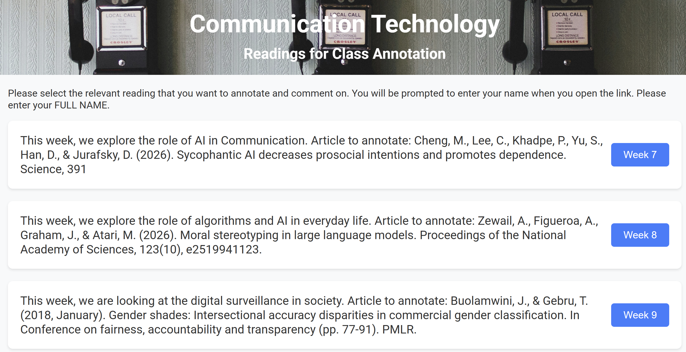
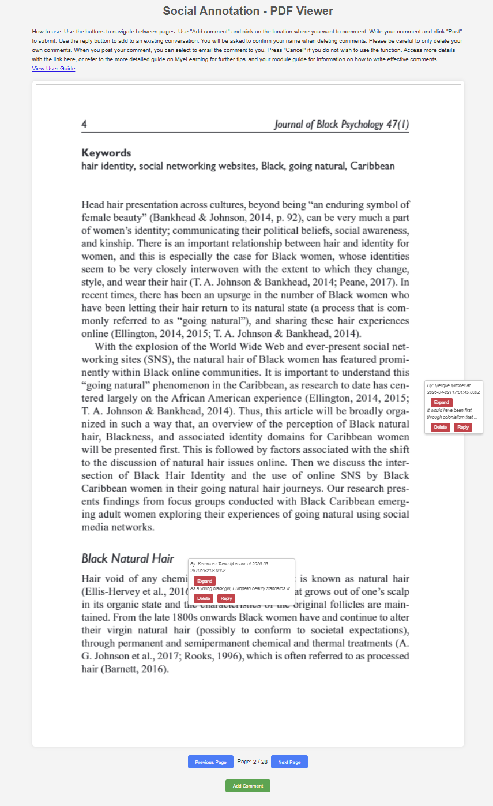

# AnnotateIt

## Why this project exists

AnnotateIt was designed as a lightweight social annotation tool for university teaching, especially in contexts where commercial annotation platforms may be expensive, institutionally unavailable, or poorly suited to local teaching needs.

The project is shaped by a few practical design choices:

- **Low-friction access:** students do not need to create an account or log in before participating. They identify themselves when commenting, which removes an additional barrier to participation while still allowing comments to be associated with a student name.
- **Accessible infrastructure:** the application uses common, low-cost tools rather than depending on a commercial annotation platform. This is particularly useful in Global South teaching contexts where subscription costs, procurement processes, or platform availability can limit access.
- **Google Sheets as the annotation datastore:** annotations are written directly to a Google Sheet rather than stored inside the web application. This makes the data easy to inspect, export, share with teaching assistants, and process with Python scripts for grading or participation analysis.
- **Easy collaboration with teaching teams:** because annotation data lives in Google Sheets, access can be managed through normal Google sharing permissions. Teaching assistants can review student participation without needing administrative access to the deployed application.
- **Course-specific adaptation:** readings, course identifiers, and weekly activities can be changed through JSON configuration files and PDF folders without rebuilding the annotation system itself.
- **Simple deployment:** the application is designed to run locally for development and on Google Cloud Run for teaching use.

The aim is not to reproduce every feature of a commercial social annotation platform, but to provide a small, adaptable system that supports collaborative reading while keeping the technical and administrative overhead manageable.

AnnotateIt is a Flask-based social annotation application for university courses. Students can open assigned PDF readings, place comments directly on the document, reply to other annotations, and optionally receive a copy of their comment by email.

Annotations are stored in a Google Sheet through a Google Apps Script web app. The Flask application can run locally or be deployed to Google Cloud Run.

## How it works

AnnotateIt keeps the student workflow deliberately simple. Students move from a course page to the assigned reading and then annotate directly on the PDF without creating a separate platform account.

### 1. Select a course

The landing page presents the available courses. Course content is kept separate so the same application can support several modules.

<p align="center">
  
</p>

### 2. Select the assigned reading

Within each course, students see the readings currently available for annotation. Reading descriptions and week numbers are loaded from the course JSON configuration files.

<p align="center">
  
</p>

### 3. Read, annotate and respond

The PDF viewer allows students to place comments at specific locations in the reading, view classmates' annotations, and reply to existing conversations. Based on my own work flow, there is a word counter that expects students to submit a comment of 25-150 words. Students provide their name when entering the annotation environment, but there is no separate account-registration or login process. For deletion, students need to enter their name again to avoid accidentally deleting other students' work. As a fail safe, deleted comments are still stored in the spreadsheet. Students can also add their email address to have the comment send to them. 

<p align="center">
  
</p>

Annotations are sent through the Flask backend to Google Apps Script and stored in Google Sheets. This keeps the deployed application lightweight while making the annotation data directly available to the teaching team for review, sharing with teaching assistants, export, and analysis with Python.

---

## Related publication

The pedagogical rationale behind this project is discussed in:

> Bengsch, G. (2026). Annotating Understanding: Reclaiming Caribbean Student Voices Through Social Reading. In *Narrative Methodologies in Educational Research* (pp. 119–154). IGI Global Scientific Publishing.

## Features

- Course and weekly reading selection
- PDF display using PDF.js
- Location-based annotations on PDF pages
- Replies to existing annotations
- Annotation deletion by changing the annotation status to `deleted`
- Optional email copy of submitted comments
- Google Sheets storage through Google Apps Script
- Flask / Gunicorn backend
- Docker and Google Cloud Run deployment support

---

## Project structure

A typical project structure is:

```text
annotateit/
├── app.py
├── requirements.txt
├── Dockerfile
├── .dockerignore
├── .gitignore
├── .env                  # local only — never commit this
├── .env.example          # safe template that may be committed
├── readings_mass_communication.json
├── readings_communication_studies.json
├── readings_communication_technology.json
├── pdfs/
│   ├── mass_communication/
│   ├── communication_studies/
│   └── communication_technology/
├── static/
│   ├── style.css
│   ├── icon.png
│   └── images/
├── templates/
│   ├── course_selection.html
│   ├── index.html
│   ├── pdf_viewer.html
│   └── user_guide.html
└── annotations/          # local/legacy CSV copies; do not use as cloud storage
```

---

# Local setup

These instructions assume Windows Command Prompt, but the same Python commands work on macOS and Linux with different virtual-environment activation commands.

## 1. Clone the repository

```bash
git clone https://github.com/GeriNZ/annotateit.git
cd annotateit
```

## 2. Install Python

Python 3.11 or 3.12 can be used. Check your installation with:

```bash
python --version
```

or on Windows:

```bash
py -3.12 --version
```

## 3. Create a virtual environment

On Windows:

```bash
py -3.12 -m venv venv
venv\Scripts\activate
```

If `py` is unavailable but `python` works:

```bash
python -m venv venv
venv\Scripts\activate
```

The prompt should now begin with:

```text
(venv)
```

Do not copy a `venv` directory from another computer. Recreate it locally.

## 4. Install dependencies

```bash
python -m pip install --upgrade pip
pip install -r requirements.txt
```

## 5. Create the local `.env` file

Create a file called:

```text
.env
```

in the project root.

Example:

```env
FLASK_DEBUG=True
MAIL_USERNAME=your_email@gmail.com
MAIL_PASSWORD=your_gmail_app_password
MAIL_DEFAULT_SENDER=your_email@gmail.com
GOOGLE_SCRIPT_URL=https://script.google.com/macros/s/YOUR_DEPLOYMENT_ID/exec
```

Do not commit `.env` to GitHub.

For Gmail, `MAIL_PASSWORD` should normally be a Google App Password rather than the normal Google account password.

Your `.gitignore` should include at least:

```gitignore
.env
.env.*
!.env.example

venv/
.venv/
__pycache__/
*.py[cod]
.vercel/
```

Your `.dockerignore` should also include:

```dockerignore
.env
.env.*
venv
.venv
__pycache__
*.pyc
.git
.vercel
```

## 6. Run the application locally

```bash
python app.py
```

The application uses port `8080` by default.

Open:

```text
http://127.0.0.1:8080
```

or:

```text
http://localhost:8080
```

---

# Adding courses and readings

Course readings are defined in JSON files named:

```text
readings_<course>.json
```

For example:

```text
readings_mass_communication.json
```

A reading entry follows this structure:

```json
[
  {
    "week": "4",
    "description": "This week, we are looking at..."
  },
  {
    "week": "5",
    "description": "This week, we are looking at..."
  }
]
```

The corresponding PDF must be stored at:

```text
pdfs/<course>/<week>.pdf
```

For example:

```text
pdfs/mass_communication/4.pdf
```

The course identifier in the JSON filename, URL, PDF folder, and Flask configuration must match.

---

# Google Sheets annotation storage

AnnotateIt uses a Google Sheet as the persistent annotation store.

## 1. Create the Google Sheet

Create a new Google Sheet.

Rename the worksheet tab exactly:

```text
Annotations
```

The first row must contain these columns in this exact order:

| Column | Header |
|---|---|
| A | Course |
| B | Week |
| C | Page |
| D | Left |
| E | Top |
| F | Width |
| G | Height |
| H | Comment |
| I | Student Name |
| J | Timestamp |
| K | Status |
| L | Parent ID |

Example:

| Course | Week | Page | Left | Top | Width | Height | Comment | Student Name | Timestamp | Status | Parent ID |
|---|---:|---:|---:|---:|---:|---:|---|---|---|---|---|
| mass_communication | 4 | 2 | 0.6016042388 | 0.5890908963 | 243 | 49 | Example annotation | Student Name | 2026-02-05 14:09:01 | active | |

The application expects `Status` to contain either:

```text
active
```

or:

```text
deleted
```

Only annotations marked `active` are returned to the PDF viewer.

`Parent ID` is used for replies. It may be blank for top-level comments.

---

# Google Apps Script setup

## 1. Find the Spreadsheet ID

A Google Sheets URL looks similar to:

```text
https://docs.google.com/spreadsheets/d/SPREADSHEET_ID/edit
```

Copy the value between `/d/` and `/edit`.

Do not place the Spreadsheet ID directly in source code.

## 2. Store the Spreadsheet ID in Apps Script properties

From the Google Sheet:

```text
Extensions → Apps Script
```

Then open:

```text
Project Settings → Script Properties
```

Add:

```text
Property: SPREADSHEET_ID
Value: your actual spreadsheet ID
```

This keeps the Spreadsheet ID out of the Apps Script source code.

## 3. Add the Apps Script code

Replace the default Apps Script code with:

```javascript
const SHEET_NAME = 'Annotations';

function getSpreadsheetId() {
  return PropertiesService
    .getScriptProperties()
    .getProperty('SPREADSHEET_ID');
}

function getAnnotationSheet() {
  const spreadsheetId = getSpreadsheetId();

  if (!spreadsheetId) {
    throw new Error('SPREADSHEET_ID is not configured in Script Properties');
  }

  return SpreadsheetApp
    .openById(spreadsheetId)
    .getSheetByName(SHEET_NAME);
}

function jsonResponse(payload) {
  return ContentService
    .createTextOutput(JSON.stringify(payload))
    .setMimeType(ContentService.MimeType.JSON);
}

function doPost(e) {
  try {
    const data = JSON.parse(e.postData.contents);
    const sheet = getAnnotationSheet();

    if (!sheet) {
      return jsonResponse({
        status: 'failure',
        message: 'Annotations sheet not found'
      });
    }

    const dataRange = sheet.getDataRange().getValues();

    // Delete request: keep the row, but change its status.
    if (data.status === 'deleted') {
      for (let i = 1; i < dataRange.length; i++) {
        if (
          dataRange[i][0] == data.course &&
          dataRange[i][1] == data.week &&
          dataRange[i][2] == data.page &&
          dataRange[i][8] == data.studentName &&
          dataRange[i][3] == data.left &&
          dataRange[i][4] == data.top &&
          dataRange[i][5] == data.width &&
          dataRange[i][6] == data.height
        ) {
          // Column K = Status = column 11 in Apps Script's 1-based indexing.
          sheet.getRange(i + 1, 11).setValue('deleted');

          return jsonResponse({
            status: 'success'
          });
        }
      }

      return jsonResponse({
        status: 'failure',
        message: 'Annotation not found'
      });
    }

    // New annotation.
    sheet.appendRow([
      data.course,
      data.week,
      data.page,
      data.left,
      data.top,
      data.width,
      data.height,
      data.comment,
      data.studentName,
      data.timestamp,
      'active',
      data.parent_id || ''
    ]);

    return jsonResponse({
      status: 'success'
    });

  } catch (error) {
    return jsonResponse({
      status: 'failure',
      message: error.toString()
    });
  }
}

function doGet(e) {
  try {
    const sheet = getAnnotationSheet();

    if (!sheet) {
      return jsonResponse({
        annotations: [],
        error: 'Annotations sheet not found'
      });
    }

    const course = e.parameter.course;
    const week = e.parameter.week;
    const page = e.parameter.page;

    const data = sheet.getDataRange().getValues();
    const result = [];

    // Start at 1 to skip the header row.
    for (let i = 1; i < data.length; i++) {
      if (
        data[i][0] == course &&
        data[i][1] == week &&
        data[i][2] == page &&
        data[i][10] == 'active'
      ) {
        result.push({
          type: 'comment',
          left: data[i][3],
          top: data[i][4],
          width: data[i][5],
          height: data[i][6],
          comment: data[i][7],
          author: data[i][8],
          timestamp: data[i][9],
          parent_id: data[i][11] || ''
        });
      }
    }

    return jsonResponse({
      annotations: result
    });

  } catch (error) {
    return jsonResponse({
      annotations: [],
      error: error.toString()
    });
  }
}
```

This version deliberately uses the Spreadsheet ID for both `doPost()` and `doGet()`. That avoids relying on `getActiveSpreadsheet()` and makes the script more reliable if it is later copied or deployed differently.

---

# Deploy the Google Apps Script as a web app

In Apps Script:

1. Click **Deploy**.
2. Choose **New deployment**.
3. Select **Web app**.
4. Set **Execute as** to yourself.
5. Choose an access setting that allows the Flask application to call the endpoint without an interactive Google login. For a public teaching app this is normally **Anyone**, subject to your Google Workspace policies.
6. Click **Deploy**.
7. Authorize the script when prompted.
8. Copy the Web App URL ending in:

```text
/exec
```

Example:

```text
https://script.google.com/macros/s/YOUR_DEPLOYMENT_ID/exec
```

Whenever the Apps Script code is changed, update the existing deployment or create a new deployment and ensure the application is using the active `/exec` URL.

---

# Connect Flask to the Google Apps Script

The Flask backend sends new/deleted annotations to the Apps Script and retrieves annotations from it.

Do not hard-code the Apps Script deployment URL in `app.py`.

Add the deployed `/exec` URL to the local `.env` file:

```env
GOOGLE_SCRIPT_URL=https://script.google.com/macros/s/YOUR_DEPLOYMENT_ID/exec
```

Near the top of `app.py`, after `load_dotenv(override=True)`, define:

```python
GOOGLE_SCRIPT_URL = os.getenv("GOOGLE_SCRIPT_URL")
```

The annotation POST helper should use the environment variable:

```python
def send_to_google_sheets(data):
    if not GOOGLE_SCRIPT_URL:
        return {
            "status": "failure",
            "error": "GOOGLE_SCRIPT_URL is not configured"
        }

    try:
        response = requests.post(
            GOOGLE_SCRIPT_URL,
            json=data
        )

        response.raise_for_status()
        return response.json()

    except requests.exceptions.RequestException as e:
        print(f"Error sending to Google Sheets: {e}")

        return {
            "status": "failure",
            "error": str(e)
        }
```

The annotation-loading route should use the same environment variable:

```python
@app.route('/load_annotations/<course>/<week>/<int:page>')
def load_annotations(course, week, page):
    try:
        print(
            f"Request to Google Script: "
            f"Course: {course}, Week: {week}, Page: {page}"
        )

        params = {
            "course": course,
            "week": week,
            "page": page
        }

        response = requests.get(
            GOOGLE_SCRIPT_URL,
            params=params
        )

        response.raise_for_status()

        print(f"Google Apps Script Response: {response.text}")

        annotations = response.json().get('annotations', [])

        return jsonify({
            'annotations': annotations
        })

    except requests.exceptions.RequestException as e:
        print(f"Error fetching annotations from Google Sheets: {e}")

        return jsonify({
            'error': 'Unable to fetch annotations'
        }), 500
```

Do not print the full Apps Script URL in application logs.

Also add a safe placeholder to `.env.example`:

```env
GOOGLE_SCRIPT_URL=
```

Never put real credentials or private configuration values in `.env.example`.

---

# How annotation storage works

When a student posts an annotation:

1. The browser sends the annotation to Flask.
2. Flask adds the course, week, timestamp, status, and reply information.
3. Flask sends the data to the Google Apps Script web app.
4. Apps Script appends a row to the `Annotations` sheet.
5. New rows receive the status `active`.

When annotations are loaded:

1. Flask sends `course`, `week`, and `page` to the Apps Script using a GET request.
2. Apps Script returns matching rows whose status is `active`.
3. Flask returns those annotations to the PDF viewer.

When an annotation is deleted:

1. Flask sends the annotation details with `status: deleted`.
2. Apps Script finds the matching row.
3. The row is retained, but column K (`Status`) is changed to `deleted`.
4. Deleted annotations are no longer returned by `doGet()`.

This provides a simple soft-delete mechanism and preserves the record in the spreadsheet.

---

# Email configuration

The application can send a student a copy of their submitted comment.

The following environment variables are used:

```env
MAIL_USERNAME=
MAIL_PASSWORD=
MAIL_DEFAULT_SENDER=
```

For Gmail:

- use the Gmail address for `MAIL_USERNAME`
- use a Google App Password for `MAIL_PASSWORD`
- normally use the same Gmail address for `MAIL_DEFAULT_SENDER`

Never commit these values to GitHub.

---

# Security

Do not commit any of the following:

```text
.env
Gmail App Passwords
API keys
service-account credentials
private tokens
```

If a secret is accidentally committed to GitHub, rotate or revoke the credential immediately. Removing the file from the latest commit does not remove it from earlier Git history.

The Google Spreadsheet ID and Apps Script deployment URL are identifiers rather than passwords, but the Sheet itself should still be shared only with the people who require direct access.

Student annotation data should not be committed to the repository.

All annotation data is stored in the configured Google Sheet, not in GitHub and not in the Cloud Run container filesystem.

---

# Google Cloud Run

The repository includes a Dockerfile for deployment to Google Cloud Run.

Cloud Run should receive secrets as environment variables or through Google Secret Manager rather than through a committed `.env` file.

The application listens on the `PORT` environment variable supplied by Cloud Run.

For automatic GitHub deployment, the Cloud Build / Cloud Run trigger should point to the repository root if the Dockerfile is stored at:

```text
/Dockerfile
```

---

# Troubleshooting

## `No Python at ...`

A copied virtual environment contains paths to the Python installation on the computer where it was created.

Delete and recreate it:

```bash
rmdir /s /q venv
py -3.12 -m venv venv
venv\Scripts\activate
pip install -r requirements.txt
```

## Google Apps Script returns no annotations

Check:

- the worksheet is named exactly `Annotations`
- the columns are in the expected A–L order
- column K contains `active`
- course, week, and page match the values sent by Flask
- the correct Apps Script deployment URL is being used
- the latest Apps Script version has been deployed

## `/static/style.css` returns 404

Confirm the file exists at:

```text
static/style.css
```

Filename capitalization matters on Linux/Cloud Run.

## Gmail returns authentication errors

Use a Google App Password rather than the normal account password and verify the values in `.env` or Cloud Run's environment/secret settings.

---

# Development notes

Annotations are not stored inside the Flask application or repository.

Google Sheets is the only persistent annotation datastore. The application sends annotation data to Google Apps Script, which writes it to the `Annotations` worksheet.

The repository should not contain an `annotations/` data folder.

Files written to a Cloud Run container filesystem are not suitable as durable application storage.

---

# License

This project is licensed under the MIT License.

```text
MIT License

Copyright (c) 2026 Geraldine Bengsch

Permission is hereby granted, free of charge, to any person obtaining a copy
of this software and associated documentation files (the "Software"), to deal
in the Software without restriction, including without limitation the rights
to use, copy, modify, merge, publish, distribute, sublicense, and/or sell
copies of the Software, and to permit persons to whom the Software is
furnished to do so, subject to the following conditions:

The above copyright notice and this permission notice shall be included in all
copies or substantial portions of the Software.

THE SOFTWARE IS PROVIDED "AS IS", WITHOUT WARRANTY OF ANY KIND, EXPRESS OR
IMPLIED, INCLUDING BUT NOT LIMITED TO THE WARRANTIES OF MERCHANTABILITY,
FITNESS FOR A PARTICULAR PURPOSE AND NONINFRINGEMENT. IN NO EVENT SHALL THE
AUTHORS OR COPYRIGHT HOLDERS BE LIABLE FOR ANY CLAIM, DAMAGES OR OTHER
LIABILITY, WHETHER IN AN ACTION OF CONTRACT, TORT OR OTHERWISE, ARISING FROM,
OUT OF OR IN CONNECTION WITH THE SOFTWARE OR THE USE OR OTHER DEALINGS IN THE
SOFTWARE.
```

A standalone [`LICENSE`](LICENSE) file is also included in the repository.

